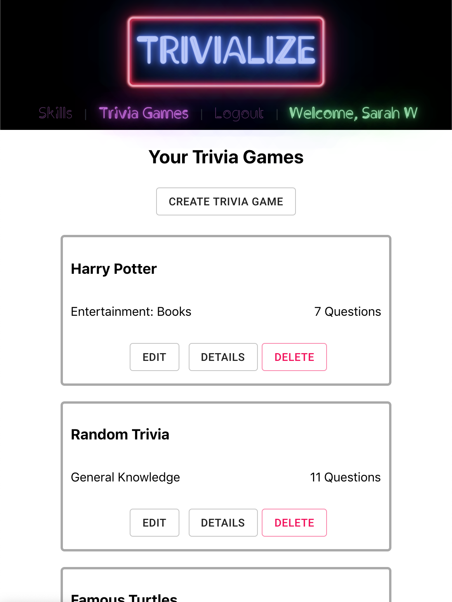

Trivialize
-

Trivialize is here for those who would like to become the next big trivia superstar! Well, I guess I shouldn't go that far... but it is here to help you build your personal trivia game database. Create your games fully, with just a question or two for now!

---

#### Technologies Used:
React, Express, Node.js, MongoDB, Mongoose, Javascript, Material UI, HTML, CSS

---

#### Getting Started:
Check it out on [Heroku](https://trivialize-app.herokuapp.com/).
See the progress process on [Trello](https://trello.com/b/dCfEldWq). View that sweet sweet code on [Github](https://github.com/arghmatey/trivialize).

---

#### Next Steps:
* Play some trivia games with other users
* Test your trivia skills with 10 question assessments in different categories
* Share your trivia games with other users (they've got to have something to play!)
